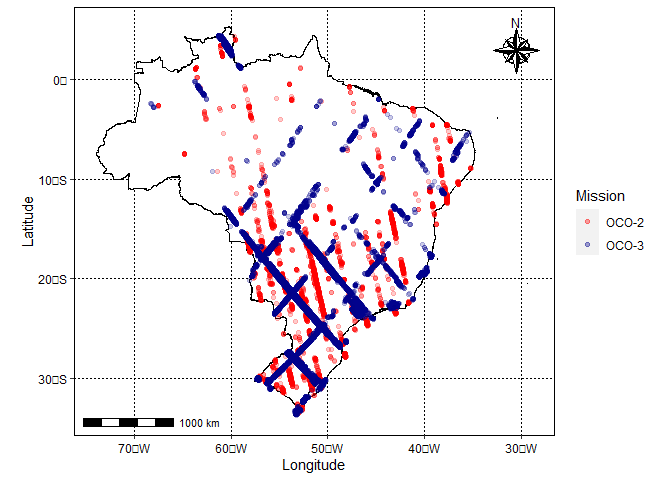
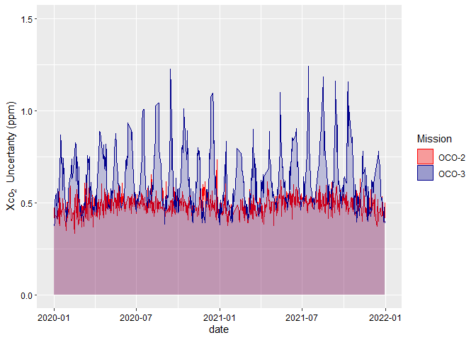
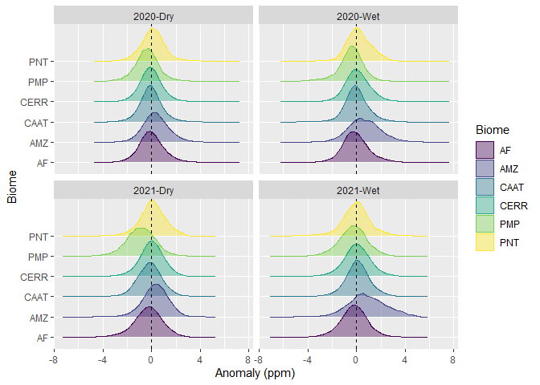
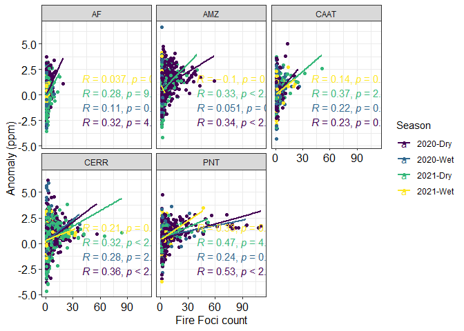
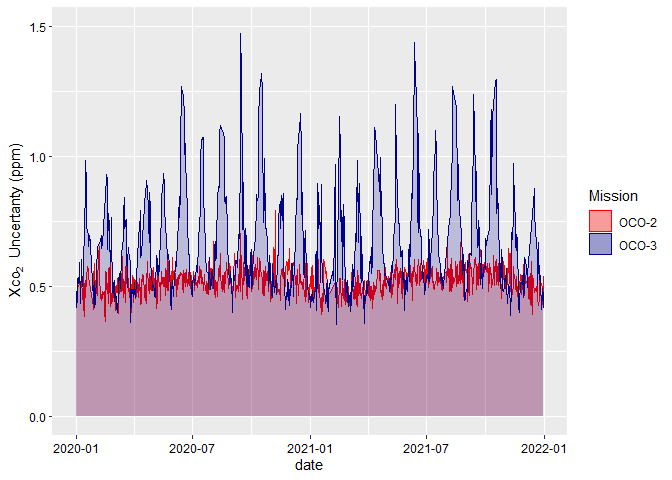
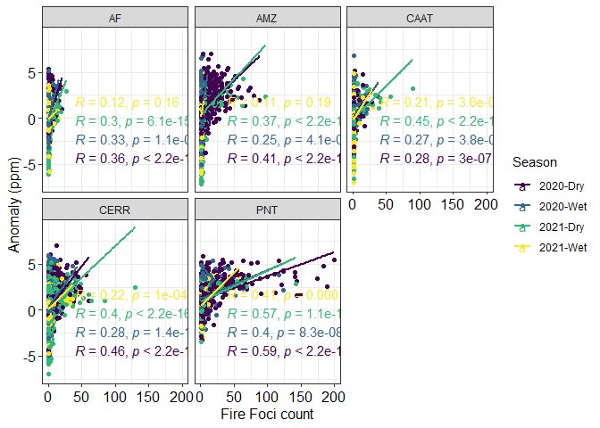

# **Exploring CO2 Anomalies in Brazilian Biomes Combining OCO-2 & 3 data: Linkages to Wildfires Patterns**

### *Costa, L.M. et al*, Advances in Space Research

## **Initial Considerations**

This is the repository linked to the [article](), here you will find the
code used to process the data from
[OCO-2](https://disc.gsfc.nasa.gov/datasets/OCO2_L2_Lite_FP_10r/summary)
and
[OCO-3](https://disc.gsfc.nasa.gov/datasets/OCO3_L2_Lite_FP_10.4r/summary),
in `R` folder you will find the script for downloading the data from the
`url` and some filters and process used. <br>

The first step is to use the `download_data.R`, than the
`data_extraction.R` and finaly the `data_filtering.R`

<br> In the following paths:`data-raw/OCO-2`, `data-raw/OCO-3`,
`data/OCO-2` and `data/OCO-3`, there are files to ensure the creation of
that path on github, however you can delete them.

Following is the steps with the already processed data

## **Good Quality data**

### **Data and functions**

``` r
source('fun/out.R')
source('fun/mapa.R')
br <- geobr::read_country()
```

    ## Loading required namespace: sf

    ## Using year 2010

    ## Downloading: 1.6 kB     Downloading: 1.6 kB     Downloading: 12 kB     Downloading: 12 kB     Downloading: 28 kB     Downloading: 28 kB     Downloading: 28 kB     Downloading: 28 kB     Downloading: 36 kB     Downloading: 36 kB     Downloading: 52 kB     Downloading: 52 kB     Downloading: 52 kB     Downloading: 52 kB     Downloading: 69 kB     Downloading: 69 kB     Downloading: 77 kB     Downloading: 77 kB     Downloading: 77 kB     Downloading: 77 kB     Downloading: 93 kB     Downloading: 93 kB     Downloading: 100 kB     Downloading: 100 kB     Downloading: 120 kB     Downloading: 120 kB     Downloading: 130 kB     Downloading: 130 kB     Downloading: 130 kB     Downloading: 130 kB     Downloading: 140 kB     Downloading: 140 kB     Downloading: 150 kB     Downloading: 150 kB     Downloading: 150 kB     Downloading: 150 kB     Downloading: 170 kB     Downloading: 170 kB     Downloading: 170 kB     Downloading: 170 kB     Downloading: 190 kB     Downloading: 190 kB     Downloading: 200 kB     Downloading: 200 kB     Downloading: 210 kB     Downloading: 210 kB     Downloading: 210 kB     Downloading: 210 kB     Downloading: 210 kB     Downloading: 210 kB     Downloading: 220 kB     Downloading: 220 kB     Downloading: 220 kB     Downloading: 220 kB     Downloading: 230 kB     Downloading: 230 kB     Downloading: 240 kB     Downloading: 240 kB     Downloading: 250 kB     Downloading: 250 kB     Downloading: 250 kB     Downloading: 250 kB     Downloading: 250 kB     Downloading: 250 kB     Downloading: 260 kB     Downloading: 260 kB     Downloading: 280 kB     Downloading: 280 kB     Downloading: 300 kB     Downloading: 300 kB     Downloading: 310 kB     Downloading: 310 kB     Downloading: 310 kB     Downloading: 310 kB     Downloading: 320 kB     Downloading: 320 kB     Downloading: 340 kB     Downloading: 340 kB     Downloading: 340 kB     Downloading: 340 kB     Downloading: 350 kB     Downloading: 350 kB     Downloading: 350 kB     Downloading: 350 kB     Downloading: 350 kB     Downloading: 350 kB     Downloading: 370 kB     Downloading: 370 kB     Downloading: 370 kB     Downloading: 370 kB     Downloading: 380 kB     Downloading: 380 kB     Downloading: 390 kB     Downloading: 390 kB     Downloading: 390 kB     Downloading: 390 kB     Downloading: 410 kB     Downloading: 410 kB     Downloading: 420 kB     Downloading: 420 kB     Downloading: 420 kB     Downloading: 420 kB     Downloading: 440 kB     Downloading: 440 kB     Downloading: 440 kB     Downloading: 440 kB

``` r
oco2 <- readr::read_rds('processed_data/oco2.rds') 

oco3 <- readr::read_rds('processed_data/oco3.rds')

frp <- read.csv('processed_data/frp.csv') |> 
  dplyr::mutate(
    lon=round(lon,2),
    lat=round(lat,2),
    year=lubridate::year(date)
  ) |> 
  dplyr::select(lon,lat,year,Period,Biome,frp) |> 
  dplyr::filter(
    frp>remove_outlier(frp)[1]&
      frp<remove_outlier(frp)[2]
  )
```

### **Coverage**

``` r
br |> 
  ggplot2::ggplot()+
  ggplot2::geom_sf(fill="white", color="black",
                   size=.15, show.legend = FALSE)+
  ggplot2::geom_point(data = oco2 |> 
                        dplyr::mutate(
                          mes=lubridate::month(date),
                          year=lubridate::year(date)
                        ) |> 
                        dplyr::filter(mes==3 & year == 2020),
                      ggplot2::aes(x=lon,y=lat,color='OCO-2'),
                      alpha=.2)+
  ggplot2::geom_point(data = oco3 |> 
                        dplyr::mutate(
                          mes=lubridate::month(date),
                          year=lubridate::year(date)
                        ) |> 
                        dplyr::filter(mes==3 & year == 2020),
                      ggplot2::aes(x=lon,y=lat,color='OCO-3'),
                      alpha=.2)+
  ggplot2::scale_color_manual(name='Mission',
                              breaks=c('OCO-2','OCO-3'),
                              values=c('OCO-2'='red', 'OCO-3'='dark blue'))+
  ggplot2::theme(axis.text = ggplot2::element_text(color='black'))+
  ggplot2::labs(x='Longitude', y='Latitude')+
  tema_mapa()
```

    ## Scale on map varies by more than 10%, scale bar may be inaccurate

<!-- -->

### **Uncertainty**

``` r
oco2 |>
  dplyr::group_by(date) |>
  dplyr::summarise(uncertanty=mean(uncertanty)) |>
  ggplot2::ggplot(ggplot2::aes(x=date,y=uncertanty))+
  ggplot2::geom_area(ggplot2::aes(color='OCO-2', fill='OCO-2'),alpha=.2)+
  ggplot2::geom_area(data=oco3 |>
                       dplyr::group_by(date) |>
                       dplyr::summarise(uncertanty=mean(uncertanty)),
                     ggplot2::aes(color='OCO-3',fill='OCO-3'),alpha=.2)+
  ggplot2::ylab(expression('Xco'[2]~' Uncertanty (ppm)'))+
  ggplot2::ylim(0,1.5)+
  ggplot2::scale_color_manual(name='Mission',
                              breaks=c('OCO-2','OCO-3'),
                              values=c('OCO-2'='red', 'OCO-3'='dark blue'))+
  ggplot2::scale_fill_manual(name='Mission',
                             breaks=c('OCO-2','OCO-3'),
                             values=c('OCO-2'='red', 'OCO-3'='dark blue'))+
  ggplot2::theme(axis.text = ggplot2::element_text(color='black'))
```

<!-- -->

### **Anomaly calculation**

``` r
oco2 <- oco2 |> 
  dplyr::filter(
    xco2 > remove_outlier(xco2)[1]&
      xco2<remove_outlier(xco2)[2]
  )
oco3 <- oco3 |> 
  dplyr::filter(
    xco2 > remove_outlier(xco2)[1]&
      xco2<remove_outlier(xco2)[2]
  )

xco2 <- rbind(oco2,oco3)

xco2 <- xco2 |>  
  dplyr::filter(
    xco2 > remove_outlier(xco2)[1]&
      xco2<remove_outlier(xco2)[2]
  ) |>
  dplyr::group_by(date) |>
  dplyr::mutate(
    Anomaly = xco2-median(xco2)
  )


xco2 <- xco2 |> 
  dplyr::mutate(
    year=lubridate::year(date),
    Biome = dplyr::case_when(
      RASTERVALU==3~'AMZ',
      RASTERVALU==6~'AF',
      RASTERVALU==7~'CERR',
      RASTERVALU==8~'CAAT',
      RASTERVALU==9~'PNT',
      RASTERVALU==10~'PMP'
    ),
    mes=lubridate::month(date),
    Period = dplyr::case_when(
      mes==1~'Wet' ,
      mes==2~ 'Wet',
      mes==3~'Wet' ,
      mes==4~ 'Dry',
      mes==5~ 'Dry',
      mes==6~ 'Dry',
      mes==7~ 'Dry',
      mes==8~ 'Dry',
      mes==9~ 'Dry',
      mes==10~ 'Wet',
      mes==11~ 'Wet',
      mes==12~'Wet'
    )
  ) |> 
  na.omit() 
```

### **Density Plot**

``` r
xco2 |>
  dplyr::mutate(
    Season=stringr::str_c(
      lubridate::year(date),Period,sep='-'
    )
  ) |>
  ggplot2::ggplot(ggplot2::aes(x=Anomaly, y=Biome,col=Biome, fill=Biome))+
  ggridges::geom_density_ridges(alpha=.4)+
  ggplot2::facet_wrap(~Season,scales = 'fixed')+
  ggplot2::geom_vline(xintercept = 0, linetype='dashed')+
  ggplot2::scale_color_viridis_d()+
  ggplot2::scale_fill_viridis_d()+
  ggplot2::xlab('Anomaly (ppm)')
```

    ## Picking joint bandwidth of 0.0969

    ## Picking joint bandwidth of 0.128

    ## Picking joint bandwidth of 0.112

    ## Picking joint bandwidth of 0.149

<!-- -->

### **Fire relation**

``` r
df <- xco2 |> 
  dplyr::mutate(
    lon=round(lon,2),
    lat=round(lat,2)
  ) |> 
  dplyr::select(lon,lat,year,Period,Biome, Anomaly) |> 
  dplyr::left_join(frp) |>
  na.omit()
```

    ## Adding missing grouping variables: `date`
    ## Joining with `by = join_by(lon, lat, year, Period, Biome)`

    ## Warning in dplyr::left_join(dplyr::select(dplyr::mutate(xco2, lon = round(lon, : Detected an unexpected many-to-many relationship between `x` and `y`.
    ## ℹ Row 4382 of `x` matches multiple rows in `y`.
    ## ℹ Row 109586 of `y` matches multiple rows in `x`.
    ## ℹ If a many-to-many relationship is expected, set `relationship =
    ##   "many-to-many"` to silence this warning.

``` r
df |>
  dplyr::mutate(
    lon=round(lon,1),
    lat=round(lat,1),
    Season=stringr::str_c(
      year,Period,sep='-'
    )) |>
  dplyr::group_by(lon,lat,Season,Biome) |>
  dplyr::summarise(
    ff=dplyr::n(),
    Anomaly=max(Anomaly)
  ) |>
  dplyr::filter(Biome != 'PMP') |>
  ggplot2::ggplot(ggplot2::aes(x=ff,y=Anomaly,col=Season))+
  ggplot2::geom_point()+
  ggplot2::geom_smooth(se=FALSE,method='lm')+
  ggplot2::facet_wrap(~Biome,scales = 'fixed')+
  ggpubr::stat_cor(method = 'spearman',label.y.npc = 'bottom',label.x =40)+
  #ggpubr::stat_regline_equation(label.y.npc = 'bottom',label.x = 30)+
  ggplot2::xlab(
    'Fire Foci count')+
  ggplot2::ylab('Anomaly (ppm)')+
  ggplot2::scale_color_viridis_d()+
  ggplot2::theme_bw()+
  ggplot2::theme(axis.text = ggplot2::element_text(color='black',size = 12),
                 axis.title = ggplot2::element_text(color='black',size=12),)
```

    ## `summarise()` has grouped output by 'lon', 'lat', 'Season'. You can override
    ## using the `.groups` argument.
    ## `geom_smooth()` using formula = 'y ~ x'

<!-- -->

## **With Cloud**

### **New data**

``` r
oco2 <- readr::read_rds('processed_data/oco2_qf_1.rds')
oco3 <- readr::read_rds('processed_data/oco3_qf_1.rds')
```

### **Uncertanity**

``` r
oco2 |>
  dplyr::group_by(date) |>
  dplyr::summarise(uncertanty=mean(uncertanty)) |>
  ggplot2::ggplot(ggplot2::aes(x=date,y=uncertanty))+
  ggplot2::geom_area(ggplot2::aes(color='OCO-2', fill='OCO-2'),alpha=.2)+
  ggplot2::geom_area(data=oco3 |>
                       dplyr::group_by(date) |>
                       dplyr::summarise(uncertanty=mean(uncertanty)),
                     ggplot2::aes(color='OCO-3',fill='OCO-3'),alpha=.2)+
  ggplot2::ylab(expression('Xco'[2]~' Uncertanty (ppm)'))+
  ggplot2::ylim(0,1.5)+
  ggplot2::scale_color_manual(name='Mission',
                              breaks=c('OCO-2','OCO-3'),
                              values=c('OCO-2'='red', 'OCO-3'='dark blue'))+
  ggplot2::scale_fill_manual(name='Mission',
                             breaks=c('OCO-2','OCO-3'),
                             values=c('OCO-2'='red', 'OCO-3'='dark blue'))+
  ggplot2::theme(axis.text = ggplot2::element_text(color='black'))
```

    ## Warning: Removed 6 rows containing non-finite values (`stat_align()`).

<!-- -->

### **Anomaly calculation**

``` r
oco2 <- oco2 |> 
  dplyr::filter(
    xco2 > remove_outlier(xco2)[1]&
      xco2<remove_outlier(xco2)[2]
  )

oco3 <- oco3 |> 
  dplyr::filter(
    xco2 > remove_outlier(xco2)[1]&
      xco2<remove_outlier(xco2)[2]
  )

xco2 <- rbind(oco2,oco3)

xco2 <- xco2 |>  
  dplyr::filter(
    xco2 > remove_outlier(xco2)[1]&
      xco2<remove_outlier(xco2)[2]
  ) |>
  dplyr::group_by(date) |>
  dplyr::mutate(
    Anomaly = xco2-median(xco2)
  )

xco2 <- xco2 |> 
  dplyr::mutate(
    year=lubridate::year(date),
    Biome = dplyr::case_when(
      RASTERVALU==3~'AMZ',
      RASTERVALU==6~'AF',
      RASTERVALU==7~'CERR',
      RASTERVALU==8~'CAAT',
      RASTERVALU==9~'PNT',
      RASTERVALU==10~'PMP'
    ),
    mes=lubridate::month(date),
    Period = dplyr::case_when(
      mes==1~'Wet' ,
      mes==2~ 'Wet',
      mes==3~'Wet' ,
      mes==4~ 'Dry',
      mes==5~ 'Dry',
      mes==6~ 'Dry',
      mes==7~ 'Dry',
      mes==8~ 'Dry',
      mes==9~ 'Dry',
      mes==10~ 'Wet',
      mes==11~ 'Wet',
      mes==12~'Wet'
    )
  ) |> 
  na.omit() 
```

### **Fire Relation**

``` r
df <- xco2 |> 
  dplyr::mutate(
    lon=round(lon,2),
    lat=round(lat,2)
  ) |> 
  dplyr::select(lon,lat,year,Period,Biome, Anomaly) |> 
  dplyr::left_join(frp) |>
  na.omit()
```

    ## Adding missing grouping variables: `date`
    ## Joining with `by = join_by(lon, lat, year, Period, Biome)`

    ## Warning in dplyr::left_join(dplyr::select(dplyr::mutate(xco2, lon = round(lon, : Detected an unexpected many-to-many relationship between `x` and `y`.
    ## ℹ Row 799 of `x` matches multiple rows in `y`.
    ## ℹ Row 109586 of `y` matches multiple rows in `x`.
    ## ℹ If a many-to-many relationship is expected, set `relationship =
    ##   "many-to-many"` to silence this warning.

``` r
df |>
  dplyr::mutate(
    lon=round(lon,1),
    lat=round(lat,1),
    Season=stringr::str_c(
      year,Period,sep='-'
    )) |>
  dplyr::group_by(lon,lat,Season,Biome) |>
  dplyr::summarise(
    ff=dplyr::n(),
    Anomaly=max(Anomaly)
  ) |>
  dplyr::filter(Biome != 'PMP') |>
  ggplot2::ggplot(ggplot2::aes(x=ff,y=Anomaly,col=Season))+
  ggplot2::geom_point()+
  ggplot2::geom_smooth(se=FALSE,method='lm')+
  ggplot2::facet_wrap(~Biome,scales = 'fixed')+
  ggpubr::stat_cor(method = 'spearman',label.y.npc = 'bottom',label.x =40)+
  #ggpubr::stat_regline_equation(label.y.npc = 'bottom',label.x = 30)+
  ggplot2::xlab(
    'Fire Foci count')+
  ggplot2::ylab('Anomaly (ppm)')+
  ggplot2::scale_color_viridis_d()+
  ggplot2::theme_bw()+
  ggplot2::theme(axis.text = ggplot2::element_text(color='black',size = 12),
                 axis.title = ggplot2::element_text(color='black',size=12),)
```

    ## `summarise()` has grouped output by 'lon', 'lat', 'Season'. You can override
    ## using the `.groups` argument.
    ## `geom_smooth()` using formula = 'y ~ x'

<!-- -->
